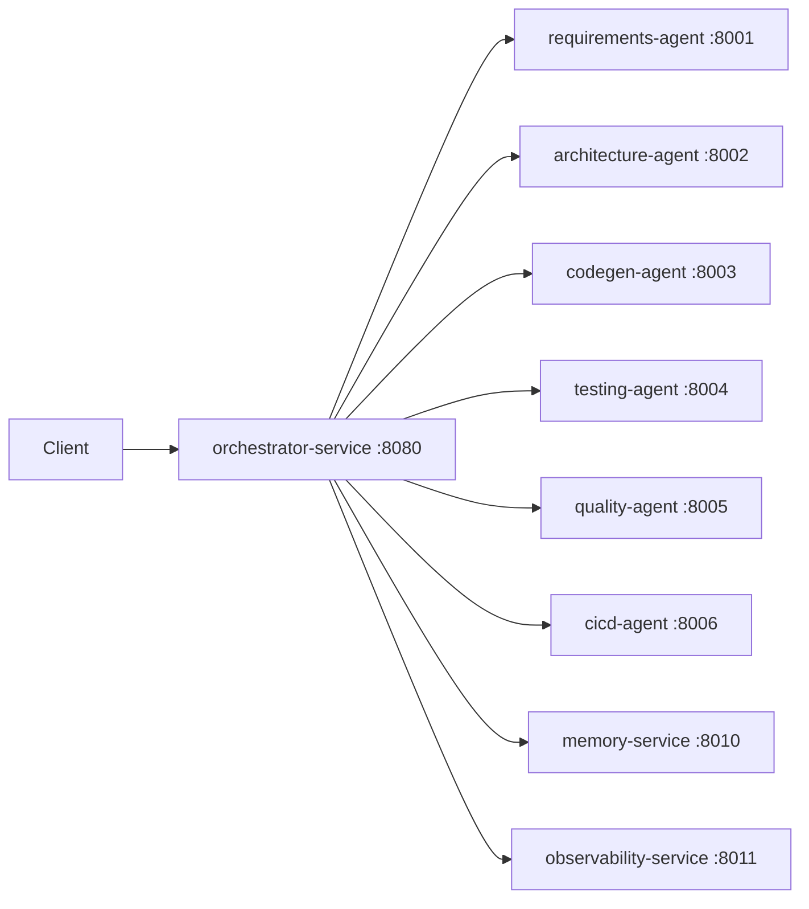

# Agentic AI Dev Factory (Spring Boot Microservices)

Architecture **Agentic AI** appliquée au **génie logiciel** : un **orchestrateur** pilote un workflow complet (spécifications → architecture → génération de code → tests → qualité → CI/CD) via des **agents microservices**.  
Le système maintient une **mémoire partagée** et une **observabilité** (traces d’exécution), puis génère automatiquement des **artefacts** (code, tests, pipeline GitHub Actions).

## Objectif
Simuler un cycle complet de développement logiciel orchestré par une équipe d’agents spécialisés, dans une architecture microservices **Spring Boot**.

## Fonctionnalités clés
- Orchestration de bout en bout via `POST /run`
- Agents spécialisés :
    - Requirements (user story + critères d’acceptation)
    - Architecture (décisions + composants + workflow)
    - Codegen (génération du code Java)
    - Testing (génération des tests JUnit)
    - Quality (rapport qualité + recommandations)
    - CI/CD (génération d’un workflow GitHub Actions)
- **Memory-service** (état global partagé clé/valeur)
- **Observability-service** (événements / traces du workflow)
- Génération automatique d’artefacts dans `runs/<timestamp>/`

## Workflow (haut niveau)
1. Requirements-agent
2. Architecture-agent
3. Codegen-agent
4. Testing-agent
5. Quality-agent
6. CI/CD-agent

## Architecture


## Microservices & ports
| Service | Rôle | Port |
|---|---|---|
| orchestrator-service | Coordination globale du workflow | 8080 |
| requirements-agent | Spécifications / user story | 8001 |
| architecture-agent | Conception / décisions d’architecture | 8002 |
| codegen-agent | Génération du code | 8003 |
| testing-agent | Génération de tests unitaires | 8004 |
| quality-agent | Analyse qualité / recommandations | 8005 |
| cicd-agent | Génération pipeline CI/CD | 8006 |
| memory-service | Mémoire partagée (state) | 8010 |
| observability-service | Traces / événements | 8011 |

## API (endpoints utiles)
### Orchestrator
- `POST http://localhost:8080/run`
- `GET  http://localhost:8080/health`

### Memory
- `GET  http://localhost:8010/state`
- `POST http://localhost:8010/state`

### Observability
- `GET  http://localhost:8011/events`
- `POST http://localhost:8011/event`

## Quickstart (local)
### Prérequis
- Java **17**
- Maven (ou Maven Wrapper `mvnw`)

### Lancer les services
Ouvre **9 terminaux** (ou utilise ton IDE) et lance chaque service :

```bash
cd services/memory-service && ./mvnw spring-boot:run
cd services/observability-service && ./mvnw spring-boot:run
cd services/requirements-agent && ./mvnw spring-boot:run
cd services/architecture-agent && ./mvnw spring-boot:run
cd services/codegen-agent && ./mvnw spring-boot:run
cd services/testing-agent && ./mvnw spring-boot:run
cd services/quality-agent && ./mvnw spring-boot:run
cd services/cicd-agent && ./mvnw spring-boot:run
cd services/orchestrator-service && ./mvnw spring-boot:run
```

> Windows : remplace `./mvnw` par `mvnw.cmd`

### Déclencher le workflow
```bash
curl -X POST "http://localhost:8080/run"   -H "Content-Type: application/json"   -d '{"goal":"calculate arithmetic operations"}'
```

### Vérifier la trace & l’état
- Observabilité : `GET http://localhost:8011/events`
- Mémoire : `GET http://localhost:8010/state`

## Artefacts générés
Après exécution, l’orchestrateur crée un dossier :
- `runs/<timestamp>/`

Exemples d’artefacts générés :
- `src/main/java/demo_app/Calculator.java`
- `src/test/java/demo_app/CalculatorTest.java`
- `.github/workflows/ci.yml`

## Tech Stack
- Java 17
- Spring Boot (REST)
- JUnit (tests)
- GitHub Actions (CI/CD)

## Contexte académique
TP **GL4IA / Architectering Agentic AI** — Master 2 Génie Logiciel (Université de Montpellier).

